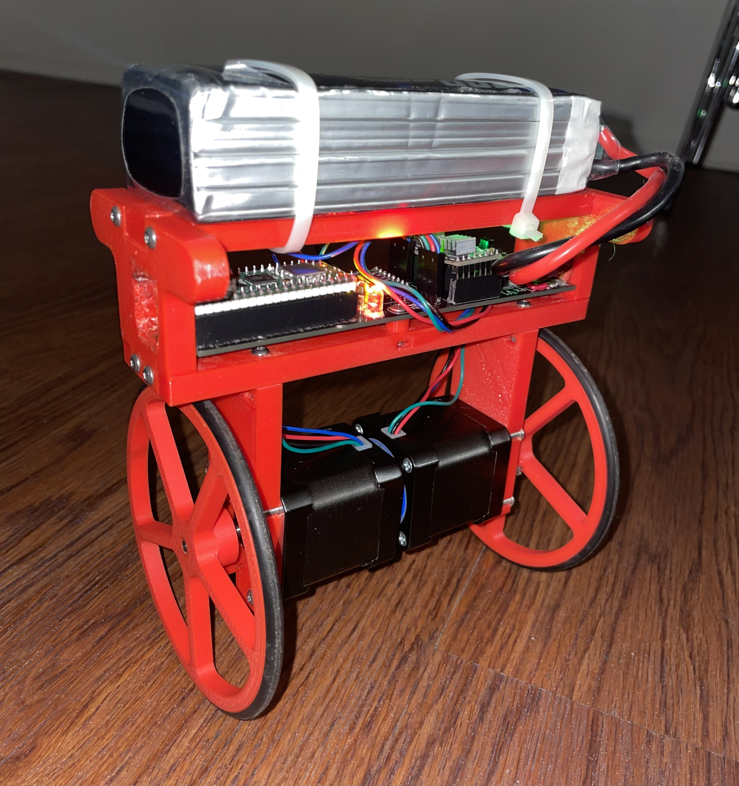
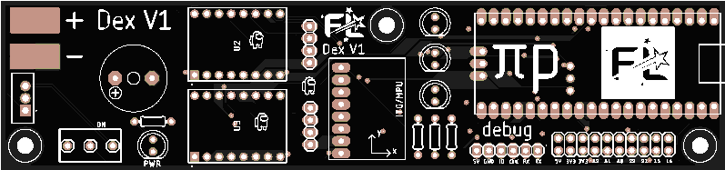
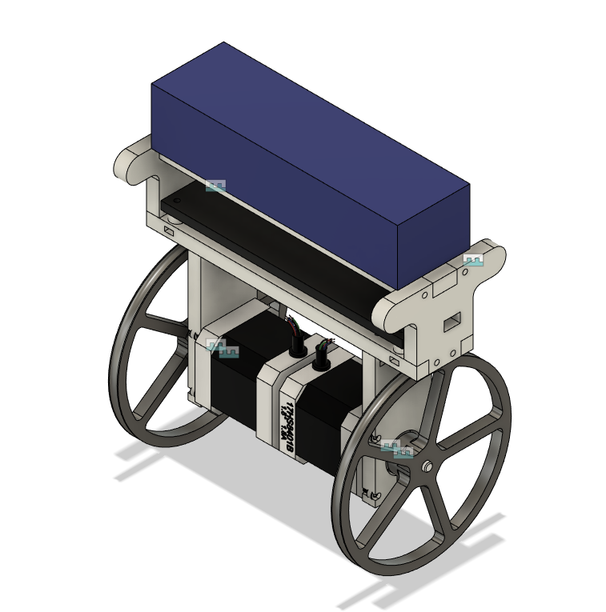

# Dex
An open source self balancing robot designed for the Raspberry Pi Pico and controlled by a DS4 controller. Dex was made with 3D printed ABS, a custom PCB, and a whole lot of patience. This repository shall serve as a guide for anyone to reference for their own balancing robot. The code is well formatted for your convenience you nerd. Note this is an intermediate project so take your time and have fun.

<div style="display:flex; justify-content:center;">
  
</div>
<br/>

## Software
This project uses the several libraries including FreeRTOS, BTstack, and the Pico SDK. Each is a specific versions and can be setup with a recursive git clone. For this project the software utilizes both cores on the RP2040.

### Core 0
The primary purpose of core 0 is to handle all of the CWY43 SPI and MPU6050 I2C interrupts that hog all the cpu.

### Core 1
The FreeRTOS scheduler runs on this core to prevent conflicting timing with the SPI interrupted. The bluetooth callback also gets processed here. 

| FreeRTOS Scheduler Tasks | Description | Task Delay us |
| ----- | ---- | ---- |
| stat_led_task | blinky blinky | 500000us |
| bt_hid_inputs | process controller inputs | 20000us |
| stepper_left_task | controls the left stepper | varying per step |
| stepper_right_task | controls the right stepper | varying per step  |
| mpu6050_task | requests gyro/accelerometer data and processed roll angle with Kalman filter | 20000us |
| pid_task | calculates the output for the stepper motors | 10000us |
| good_boy_task | watches the dog | 500000us |

### Overclocking
Please note this project overclock the RP2040 to 250MHz and configures the configTICK_RATE_HZ 100000 (10us period). This is to give enough time for the schedule overhead. The reason for the high tick rate is because the steppers need step at very high rates.

## PCB 
This PCB was made in Eagle Cad and can find the PCB under resources/pcb. Please note there are two mistakes that i've hand wired for this current pcb. The holes for the switch are too small and cut traces to make the switch come before the 5V regulator. I'll update the files with a fixed design soon.

<div style="display:flex; justify-content:center;">
  
</div>

## CAD
This project was designed in Fusion 360 and all the files can be found under resources/cad. 
<div style="display:flex; justify-content:center;">
  
</div>


## BOM 💣

| Name                    | Count | Price (meets count) | Description                               | Rating                   | Notes                                        | Link                                                                                                                             |
|-------------------------|-------|----------------------|-------------------------------------------|--------------------------|----------------------------------------------|-----------------------------------------------------------------------------------------------------------------------------------|
| Raspberry Pi PIco W      | 1     | $18.96               | MPU                                       | Clock: 135MHz            | 2 Cores                                      | [Amazon Link](https://www.amazon.com/gp/product/B0B72GV3K3/ref=ewc_pr_img_12?smid=A1PI3LRUETBKN8&psc=1)                            |
| PCB                     | 1     | $24.05               | Custom PCB designed                        | Engineering Level: Maximum | Designed in Eagle and order on JLCPCB        | N/A                                                                                                                               |
| NEMA 17 Stepper         | 2     | $13.99               | Main Motors                                | Max Current 2a           |                                              | [Amazon Link](https://www.amazon.com/gp/product/B0B72GV3K3/ref=ewc_pr_img_12?smid=A1PI3LRUETBKN8&psc=1)                            |
| Stepper Driver A4988    | 2     | $14.99               | Drives the stepper motors                  | Min Step Rate: 500kHz    |                                              | [Amazon Link](https://www.amazon.com/gp/product/B09X382335/ref=ewc_pr_img_2?smid=A1VTL661FOEJB1&th=1)                            |
| MPU-6050                | 1     | $7.59                | 3 Axis Gryo and Accelerometer               | 16bit                    |                                              | [Amazon Link](https://www.amazon.com/gp/product/B0B3D6D1KD/ref=ppx_yo_dt_b_search_asin_title?ie=UTF8&psc=1)                      |
| L7805CV                 | 1     | $8.59                | 5V Voltage Regulator                       | 35Vin and 5Vout/1.5A     |                                              | [Amazon Link](https://www.amazon.com/gp/product/B0CBKCDT4H/ref=ewc_pr_img_1?smid=A3FX7C4A9P37IQ&th=1)                             |
| Power Switch            | 1     | $6.99                | AC 125V 2A                                 |                          | Only cuts power 5V power not stepper input voltage | [Amazon Link](https://www.amazon.com/gp/product/B099N61GTZ/ref=ewc_pr_img_3?smid=A3KX1QBS9AS0L7&th=1)                              |
| LED                     | 4     | $11.99               |                                           | Forward Voltage: R/Y 2.0-2.2V; B/G/W 3.0-3.2V; Max. Current: 20mA | User about 100Ohm resistor                | [Amazon Link](https://www.amazon.com/DiCUNO-450pcs-Colors-Emitting-Assorted/dp/B073QMYKDM/ref=sr_1_3?crid=25RYXUCKOI5YQ&keywords=led+5mm&qid=1702651386&s=hi&sprefix=led+5mm%2Ctools%2C109&sr=1-3) |
| Beeper                  | 1     | $7.99                | Active beeeper                             | 2.5-4V/25mA.             | Make sure to be extra annoying                   | [Amazon Link](https://www.amazon.com/gp/product/B07VRK7ZPF/ref=ewc_pr_img_5?smid=A10PG8DP5LW0Q1&psc=1)                           |
| Resistors               | 4     | $5.99                | Resistor for LEDS                          |                          |                                              | [Amazon Link](https://www.amazon.com/MCIGICM-Values-Resistor-Assortment-Resistors/dp/B06WRQS97C/ref=sr_1_3?crid=1DUTLH3JED9NZ&keywords=resistor+pack&qid=1702651595&s=electronics&sprefix=resistor+pack%2Celectronics%2C136&sr=1-3) |
| Headers                 | N/A   | $7.99                | Used for PCB and IO                        |                          |                                              | [Amazon Link](https://www.amazon.com/2-54mm-Breakaway-Female-Connector-Arduino/dp/B01MQ48T2V/ref=sr_1_3?crid=3A3SUEBT5HOUP&keywords=headers%2Bmale%2Band%2Bfemale&qid=1702651771&sprefix=headers%2Bmale%2Band%2Bfemail%2B%2Caps%2C112&sr=8-3&th=1) |
| Battery                 | 1     | $44.99               | Any 4s Lipo will work                     | 4S Lipo Battery 5200mAh 14.8V 60C |                                              | [Amazon Link](https://www.amazon.com/Pairs-Connector-Female-Silicon-Battery/dp/B07QM1WS2J/ref=sr_1_6?crid=2MAGLONAR29QX&keywords=Dean+t+plug&qid=1702651946&s=toys-and-games&sprefix=dean+t+plu%2Ctoys-and-games%2C98&sr=1-6) |
| O rings                 | 2     | $5.99                | Goes over 3d printed wheel for grip        | 110mm OD 100mm ID 5mm Width | I used the wheels from Wouter [here](https://elexperiment.nl/2018/11/high-speed-balancing-robot-introduction/)             | [Amazon Link](https://www.amazon.com/gp/product/B07GXFKGNT/ref=ppx_yo_dt_b_search_asin_title?ie=UTF8&th=1)                       |
| 3D Printed Chassis       | 1     | 0                    | Main body of the robot                     |                          | Designed in Fusion 360                         | N/A                                                                |
| 3D printed Wheels       | 2     | 0                    | Main wheels with rubber O rings            | Designed in Fusion 360 CREDIT DESIGN |                                           | N/A                                                            |

## Known Issues
Sometimes the program will halt when trying to connect to the BT HID.


## Starting Debugger
Plug in debugger and run:
```
openocd -f interface/cmsis-dap.cfg -c "adapter speed 5000" -f target/rp2040.cfg -s tcl
```
confrim this starts on localhost:3333

open another terminal and run:
```
gdb-multiarch dex.elf
```
in this termincal type the command
```
target remote localhost:3333
```
load with 
```
load
```